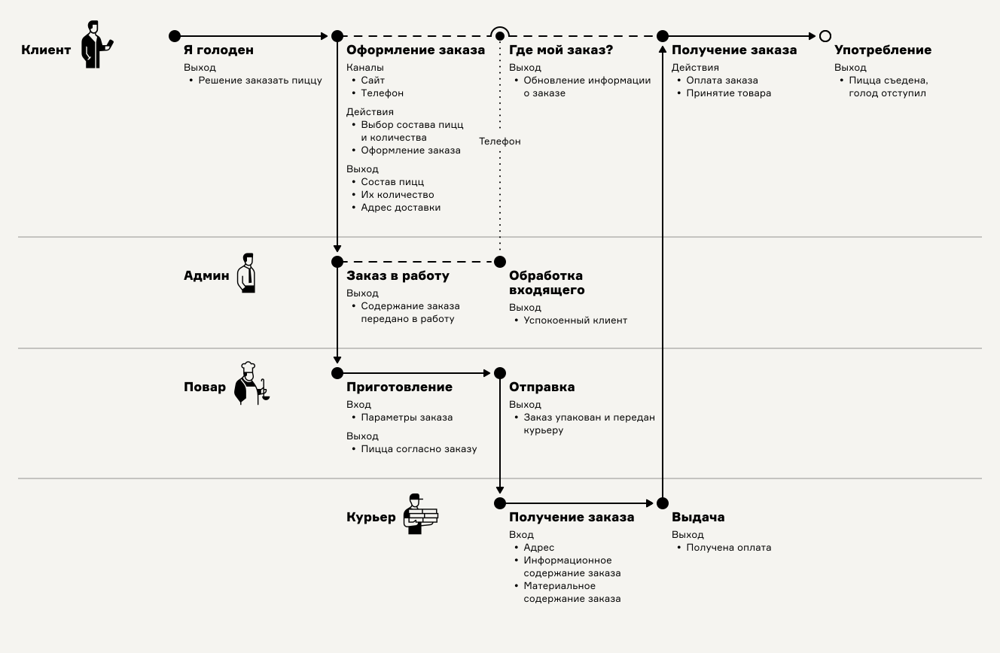
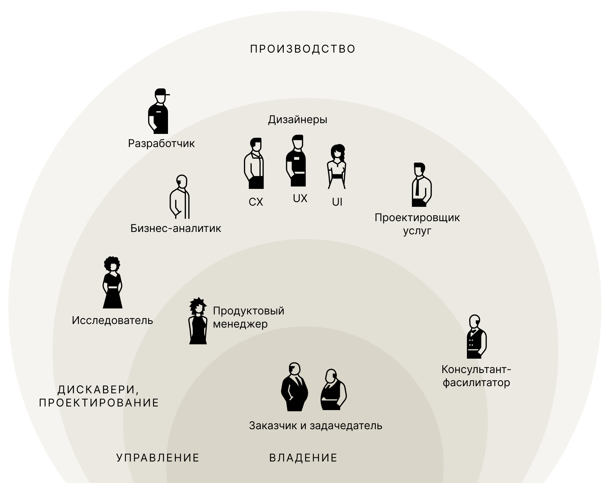

# О карте процесса-опыта

**Карта процесса-опыта** — это подход к быстрому макетированию процесса с учётом качества человеческого опыта. Результат макетирования — лаконичная карта-схема. С ней заинтересованные лица за считанные минуты приходят к единому пониманию любых последовательностей, будь то цепочки ключевых точек потребительского опыта или события и операции рабочих процессов.&#x20;

Подход междисциплинарен и собирает вместе предметы сервис-дизайна, проектирования взаимодействия, анализа бизнес-процессов и инженерии требований. Пристальное рассмотрение ключевых взаимодействий людей и машин помогает спроектировать наилучший пользовательский опыт.

<figure><figcaption>
Карта процесса-опыта услуги по изготовлению пиццы на заказ
</figcaption></figure>

### Преимущества

* Лаконичная, ясная и наглядная схема процесса целиком
* Баланс между понятностью и информативностью
* Минимум элементов нотации, как следствие, быстрое освоение и высокая скорость ведения сессий сбора требований о процессе
* Гибкость в выборе масштаба схемы за счёт понятия ключевой точки
* Центрированность на индивидуальном человеческом опыте и местах взаимодействий людей и сервисов
* Поддержка нелинейного пользовательского пути при сохранении детальных описаний ключевых точек

<figure><figcaption>
Роли в разработке современных продуктов и услуг, использующие Карту процесса-опыта
</figcaption></figure>

### Кому подходит особенно 

* CX, UX, UI и продуктовым дизайнерам, проектировщикам услуг
* Бизнес-аналитикам
* Исследователям
* Продуктовым менеджерам
* Консультантам и фасилитаторам проектно-аналитических сессий
* Заказчикам и задачедателям

### Незаменима в ситуациях, когда важно

* Обрести единый язык общения о процессах в множестве команд, между специалистами разного профиля
* Исследование и моделирование взаимосвязанных процессов и опыта взаимодействия множества участников
* Продемонстрировать процесс заинтересованным лицам без аналитической подготовки
* Организовать работу по развитию продукта или услуги системно, на основе структуры процесса-опыта
