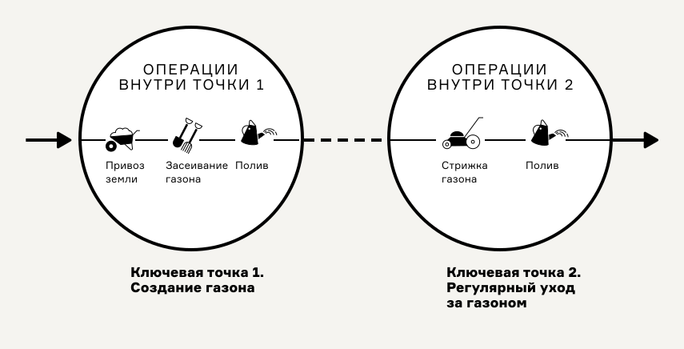

# Ключевые точки

Ключевые точки — места, в которых происходят одно из трёх:

* принятие решений с точки зрения опыта человека,
* взаимодействие людей и машин,
* преобразования вещей и информации.

Ключевые точки — это НЕ отдельные действия людей и машинные операции, а их группировка в едином пространстве-времени.

<figure><figcaption>
Здесь две ключевые точки заключают внутри себя несколько операций
</figcaption></figure>

## Выявление ключевых точек

Ключевые точки выявляют на основании наличия одного из трёх: решения, преобразования или касания.

1. К **решениям** относятся любые важные события в индивидуальном опыте участников. Это может быть какое-то спонтанное желание по утолению голода, а может быть принятие серьёзного решения в собственной жизни. Решения рассматриваются не все, а те, что дают важные сведения в контексте целей картирования.

<figure><figcaption>
Ключевые точки как инсайты и решения в опыте потребителя
</figcaption></figure>

2. Наличие **касания** определяется по пересечению воображаемой линии сервиса, когда человек приходит в офис или открывает веб-сайт, он таким образом пересекает эту линию. При касании происходит встреча потребителя с лицом сервиса в виде человека-служащего, либо заменяющего его артефакта: например, пользовательского интерфейса или визитки. Факт пересечения линии сервиса — сигнал о наличии ключевой точки.

<figure><figcaption>
Точка как место касания
</figcaption></figure>

3. **Преобразованиям** могут подвергаться как информация и вещи, так и убеждения и решения людей. Проектируя услугу нам часто важно влиять на людские впечатления и их внимание. Любое общее место в процессе, где есть явный _вход_ (что-то дано) и _выход_ (что-то требуется получить в результате) — хороший кандидат на ключевую точку.&#x20;

<figure><figcaption>
Преобразование внутри ключевой точки
</figcaption></figure>

Не всегда понятно какими средствами создаётся тот или иной артефакт. Когда требуется детальное проектирование, учитывают по отдельности каждый варианта входных данных, обрабатывающих их операций,  необходимых для них инструментов и продукта на выходе.

<figure><figcaption>
Преобразование в ключевой точки с учётом артефактов, операций и инструментальных средств
</figcaption></figure>

