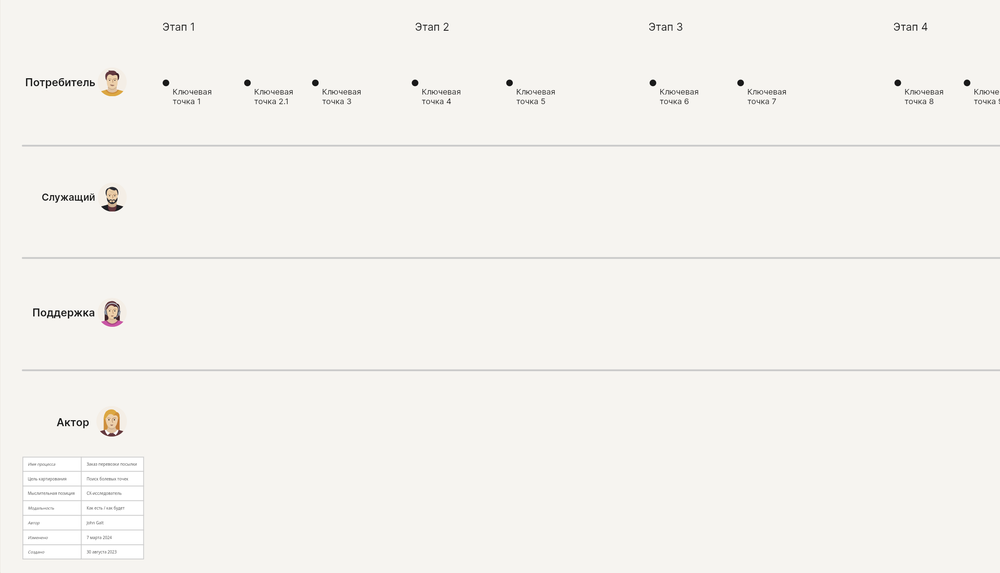

# 2. Выявление дорожек участников

1. Возьмите шаблон Карты процесса-опыта
2. Разместите дорожку потребителя сверху карты. На первом этапе достаточно&#x20;
3. Выложить каждую последующую дорожку так, чтобы её участник обслуживал того, кто выше. Таким образом, все обслуживающие дорожки идут сверху-вниз друг за другом. Так будет меньше лишних переходов через всю карту

<figure><figcaption></figcaption></figure>

