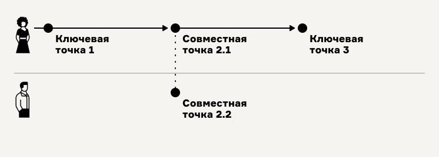

# 3. Выявление ключевых точек

1. Организуйте порядок по выявлению ключевых точек одним из двух способов
   1. **От начала до конца в последовательности протекания процесса.** Например, процесс подготовки себя к рабочему дню начнётся с пробуждения, затем, вероятно, последуют процедуры ухода за телом, разминка, завтрак и бодрящие напитки, поездка или прогулка до места работы.
   2. **В произвольном месте процесса.** Возьмите интересующее вас место в процессе. «Разрежьте» процесс в этом месте в двух местах: чуть до интересующего момента и чуть после него. Так вы сможете выявить первую ключевую точку по типу «Место изменения», см. ниже. Когда определите первую интересующую ключевую точку, организуйте движение «влево» (в предшествующие моменты) или «вправо» (в последующие моменты) в зависимости от ваших потребностей. Например, мы можете разрезать процесс утренних процедур в месте «Придание себе бодрости». Что происходит до этого? Что происходит после? Записав ответы на эти вопросы во входы и выходы или выделив соседние точки, можно двигаться дальше.
2.  Определите ключевые точки поиском в процессе ситуаций трёх типов.

    1. **Место принятия решений и важных осведомлений**. Места в процессе, где человек принимает решение, что-то узнаёт, понимает или до чего-то догадывается. Например, «Я — голоден», «Я не тяну, мне нужен помощник», «Поеду на такси», «Ура. Пройдена половина пути!». В подобных точках мы всегда видим явным образом потребность участника и момент, когда его внимание направлено на неё.
    2. **Место изменений.** Места в процессе, где происходит изменение информации или вещей. Большинство ключевых точек — ситуации изменения. Для таких точек важно выявлять Вход — то, что было дано в качестве начальных условий, и Выход — то, что требуется получить в результате. Например, вы предварительно намечаете точку, называя её «Начало консультации» для участников «Клиент» и «Психотерапевт». Что будет изменяться внутри этой точки? Вероятно в начале ситуации психотерапевт имеет только _смутный запрос клиента_ (вход), а в результате должен совместно с клиентом прийти к _чёткому пониманию потребности_ (выход). После фиксации входа и выхода, вероятно, вы и переименуете точку — «Выявление потребности».
    3. **Место контакта.** Места в процессе, где участники соприкасаются и взаимодействуют с частями системы или друг с другом. Такие места могут быть описаны как одной ключевой точкой на дорожке потребителя, так и парными точками на дорожках каждого из участников, соединенными вертикальной точечной линией.

    <figure><figcaption></figcaption></figure>

    Подробнее и в картинках о понятии ключевой точки читайте в разделе [Ключевые точки.](../../praktiku/vazhnye-ponyatiya/klyuchevye-tochki.md)
3. Обнаружив точку, зафиксируйте её на карте. Для этого дайте ей имя, выбрав его из имён существительных, словосочетаний, ёмко описывающих ситуацию и место точки. Если вы определили точку как место изменений, зафиксируйте вход и выход. Обратите внимание, что для ключевых точек контакта входы и выходы точек каждого участника будут разными.

