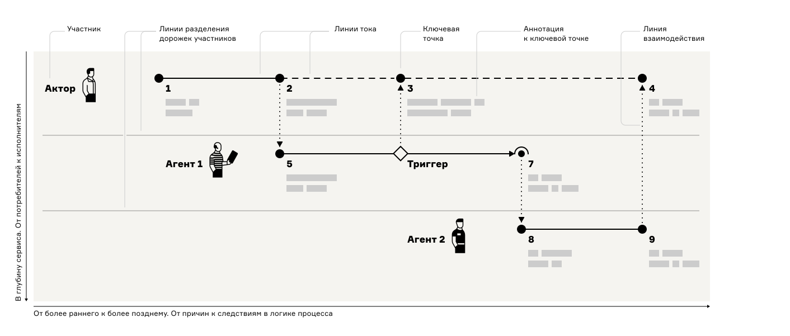
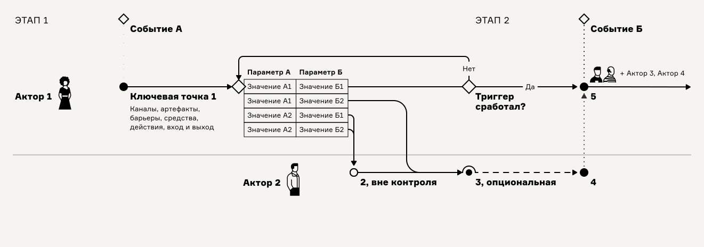

# Структура карты и элементы

<figure><figcaption></figcaption></figure>

* **Акторы 👩 и агенты 👱🏻‍♂️🤖** — действующие лица, имеющие намерения и свободу действий или те, кто обслуживает процесс, включая машинные сервисы. Акторы не подчинены нам, агенты подчиняются нам в силу регламентов или алгоритмов.
* **Ключевые точки ●** — наиважнейшие места, где происходит одно из трёх: принятие решения, преобразование, взаимодействие двух участников или участника и системы.
* **Линии тока** — соединительные линии, собирающие ключевые точки одного участника на его дорожке в последовательную цепочку процесса-опыта.
* **Линии взаимодействий** — вертикальные линии, соединяющие ключевые точки на дорожках разных акторов и агентов в единый процесс-механизм.
* **Триггеры ◇** — элементы ветвления в логике процесса. Триггеры как спусковые крючки пускают дальнейшее движение потока по одной или нескольким веткам процесса-механизма. Триггеры работают как условия в блок-схемах.
* **События ◇** — мгновенные изменения состояний, вехи в процессе, служащие для ориентации в карте или запуска от них линий тока.
* **Аннотационный блок** — блок с описанием важных параметров точки контакта. Минимально содержит описания входа, выхода, канала, артефактов или используемых систем, барьеров и средство их преодоления.&#x20;

Подробнее об элементах карты [см. в статье](https://ashapiro.ru/articles/xpm#elements) о карте процесса-опыта.

## Графические обозначения на карте 

<figure><figcaption></figcaption></figure>

<table><thead><tr><th width="86">Знак</th><th>Описание обозначения</th></tr></thead><tbody><tr><td>●</td><td>ключевая точка</td></tr><tr><td>○</td><td>ключевая точка вне контроля</td></tr><tr><td>◠</td><td>опциональная ключевая точки или обход ключевой точки — рисуется поверх кружка ключевой точки</td></tr><tr><td>◇</td><td>триггер или событие</td></tr><tr><td>⎯</td><td>линия тока</td></tr><tr><td>┈</td><td>линия тока с задержкой или обрывом</td></tr><tr><td>⦙</td><td>линия взаимодействия</td></tr></tbody></table>

