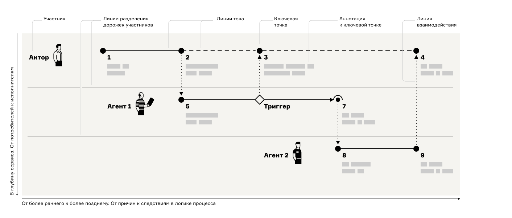
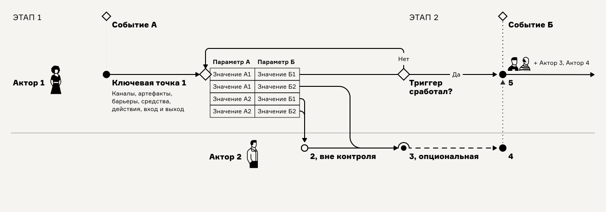

# Структура карты и её элементы

<figure><figcaption>
Схематичное изображение Карты процесса-опыта. Ключевые точки вместо названий пронумерованы. Аннотация под точками схематично изображена серыми блоками
</figcaption></figure>

## Общая структура карты

Слева направо в карте идут события и ключевые точки для каждого отдельного участника. Последовательность слева–направо выстраивается в соответствии с порядком следования событий в жизнедеятельности.

Сверху вниз располагаются дорожки всех участников процесса-коллаборации. Первой сверху помещают дорожку потребителя услуги (актора). Ниже идут поддерживающие опыт потребителя дорожки служащих (агентов).

## Элементы карты

* **Акторы 👩** — действующие лица, имеющие намерения и свободу действий. Акторы обычно не подчинены нам. Например, потребитель услуги. **Агенты 👱🏻‍♂️🤖** — те участники, кто обслуживает процесс. Агентами могут быть как люди, так и машинные сервисы. Агенты подчиняются нам в силу регламентов или алгоритмов
* **Ключевые точки ●** — наиважнейшие места в опыте или процессе, где происходит одно из трёх:&#x20;
  * принятие решения,&#x20;
  * изменение чего-то,&#x20;
  * контакт и взаимодействие двух участников или участника и системы.
* **Линии тока** собирают точки в последовательную цепочку
* **Линии взаимодействий,** вертикальные, соединяют ключевые точки на дорожках разных участников, синхронизируя их друг с другом
* **Триггеры ◇** организуют ветвление процесса. Триггеры, как спусковые крючки, пускают дальнейшее движение потока по одной или нескольким веткам
* **События ◇** — мгновенные изменения состояний, вехи в процессе, служащие для ориентации в карте или запуска от них линий тока
* **Аннотационный блок** **точки** собирает под каждой ключевой точкой описание её важнейших параметров. Минимально содержит описания входа, выхода, канала, артефактов или используемых систем, барьеров и средство их преодоления
* **Аннотационный блок карты** собирает названия процесса, цели картирования, позицию, модальность, авторов и даты внесения изменения в карту

Подробнее об элементах карты [см. в статье](https://ashapiro.ru/articles/xpm#elements) о Карте процесса-опыта.

## Графические обозначения на карте 

<figure><figcaption></figcaption></figure>

<table><thead><tr><th width="86">Знак</th><th>Описание обозначения</th></tr></thead><tbody><tr><td>●</td><td>ключевая точка</td></tr><tr><td>○</td><td>ключевая точка вне контроля</td></tr><tr><td>◠</td><td>опциональная ключевая точки, рисуется поверх кружка ключевой точки как её обход</td></tr><tr><td>◇</td><td>триггер или событие</td></tr><tr><td>⎯</td><td>линия тока</td></tr><tr><td>┈</td><td>линия тока с задержкой или обрывом</td></tr><tr><td>⦙</td><td>линия взаимодействия</td></tr></tbody></table>

## [Шаблон](https://app.holst.so/board/template/79e23903-69ca-461f-903d-fb50e8beba5a) карты

<figure><figcaption></figcaption></figure>

[Другие шаблоны](../praktiku/shablony.md)
