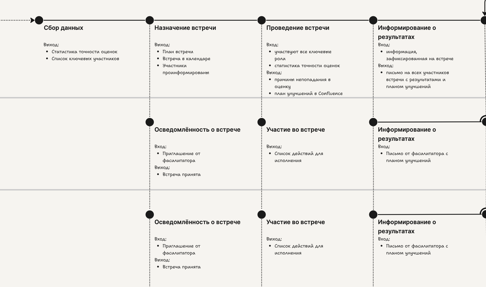

# Ошибки структуры карты

## **Липовая синхронность**

<figure><figcaption></figcaption></figure>

Частая ошибка — оформить несколько дорожек участников общими синхронными точками тогда как они не синхронны. На картинке точки нескольких участнков выровнены по вертикали и соединены точечной линией взаимодействия. Ошибка здесь в том, что эти точки для описываемого процесса в действительности не происходят синхронно.

В примере это точки «Назначение встречи» и «Проведение встречи». Согласно нотации Карты процесса-опыта точки ниже прикреплены к ним так, как будто случаться единомоментно. При этом не уточняется, что именно является условием входа у каждого из участников. Как итог — либо упускают наличие здесь процесса, либо не учитывают задержки на входах в точках других участников.

В приведённом выше примере, если кто-то назначает встречу, то он вероятно ждёт подтверждения приглашённых. Пока договариваются о дате, переносят её, иногда несколько раз, дожидаются ответа всех участников. Поэтому здесь вероятно будет ряд коммуникаций и несколько петель взаимодействий. Посыл-предложение, затем отказ или подтверждение, затем тот, кто отправлял должен это увидеть и что-то вновь предпринять в ответ. Всё это произойдёт не одномоментно, а значит это не синхронная точка, а несколько точек, соединённые линиями тока в процесс.&#x20;

<figure><figcaption>
Вариант перестройки карты. Расписанный процесс договорённости о встрече
</figcaption></figure>

Конечно же, если содержание этого процесса вам, как составителю карты, неважно,  достаточно поместить всё это внутри одной ключевой точки, что и сделано в карте-примере с ошибкой. Однако точки снизу названы «Осведомлённость о встрече». Значит встречу участнику вероятнее всего назначают без его участия. Его действием будет осведомиться и прийти на неё. Однако получение этого сигнала не произойдёт моментально и именно в тот момент, когда кто-то эту встречу назначил. Участник может быть не у компьютера, без телефона, не в сети, долгое время заниматься иным, что приведёт к задержке получения сигнала, чего на карте не изображено. На карте изображена железобетонная уверенность в том, что он осведомлён. Логика же моделирования должна быть иной — все разрывы, какие могут произойти, произойдут.

Вспомогательными вопросами здесь могли бы быть такие.

* У вас действительно синхронное взаимодействие со всеми участниками? Они находятся в одной ситуации, сидя за одним столом или находясь на общем звонке? &#x20;
* Сигнал, посылаемый им доходит до каждого мгновенно и стартует их ситуацию?

Если нет, необходимости рассматривать целиком весь процесс, синхронной можно оставить лишь точку встречи, а подготовку встречи собрать в одну точку, детально расписав в ней действия и выход.

<figure><figcaption>
Вариант перестройки карты. Организовать всё через одну точку на подготовку и одну на встречу.
</figcaption></figure>

## **Система на отдельной дорожке**

Одна из частых ошибок у начинающих использовать Карту процесса-опыта — размещение разрабатываемой ИТ-системы на отдельной дорожке, как будто это участник взаимодействия.&#x20;

Делать так не нужно и даже вредно. Дело в том, что в этом случае фокус внимания смещается на вашу ИТ-систему или её часть как участника. Как будто вам нужно обслуживать её опыт и считаться с ней, а не выстраивать её как требуется. Так вы перестаёте видеть чистую структуру процесса-опыта с её живыми участниками без привнесения в нее конкретных инструментальных решений.&#x20;

Разрабатываемая система появляется в аннотациях к ключевым точкам. Место для неё такие слои информации как каналы, средства, артефакты входа/выхода, действия. Приведу пример для вымышленной ключевой точки «Обработка нового заказа». Читатель узнают в нём паттерн ручной интеграции. В примере ИС-1, ИС-2  — информационные системы. &#x20;

<table data-header-hidden><thead><tr><th width="142"></th><th width="588"></th></tr></thead><tbody><tr><td><em>Вход</em></td><td>ИС-1: параметры новой заявки </td></tr><tr><td><em>Действия:</em> </td><td>Участник считывает визуально параметры заявки в ИС-1 и переносит их в ИС-2</td></tr><tr><td><em>Выход:</em></td><td>ИС-2: новый заказ</td></tr></tbody></table>

Когда же допустимо размещать системы на дорожке? Только когда это внешние сервисы и API с которыми вам реально нужно взаимодействовать и поменять вы их не можете.


