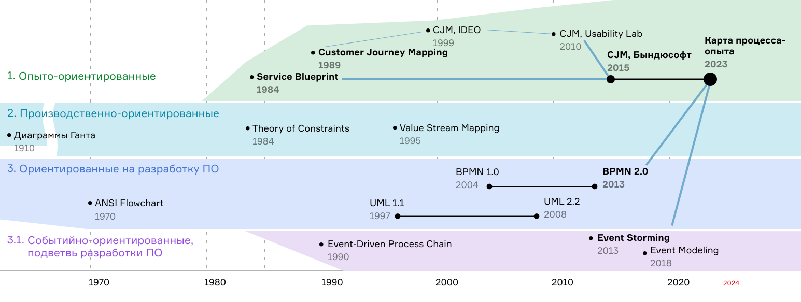

# История и сравнение метода

Корни метода уходят на пятьдесят лет в прошлое. Предтечи можно разбить на несколько направлений. Подходы к схематизации процессов развивались параллельно в сферах поточного производства в машиностроении, в разработке программного обеспечения и в сфере услуг.

Ниже приведена хронология основных вех в развитии методов схематизации вычислительных, производственных и прочих хозяйственных процессов. Приведены даты появления, названия ключевых диаграмм или методов и важное новшество, что они привнесли.

<figure><figcaption></figcaption></figure>

#### Ветка схематизации процессов в сфере информационных технологий

* 1970, ANSI Flowchart — широко известная нотация блок-схем. Появление стандарта по обозначению ветвления в программах.
* 1997, UML 1.1 — многоцелевая нотация с диаграммами структуры объектов и их поведения, выросшая из объектно-ориентированной парадигмы проектирования и разработки. Схематизация сильна учётом инженерных механик, принятых в разработке программного обеспечения.
  * 2008, UML 2.2 — максимальная точка развития UML на текущий момент. После разработчики стандарта перешли к нотации BPMN.
* 2004, BPMN 1.0 — нотация, созданная в кооперации с бизнес-аналитиками и нацеленная на управляемость и автоматизацию бизнес-процессов.
  * 2013, BPMN 2.0 — максимальная на 2024-й год точка развития стандарта.
* Событийно-ориентированное (англ. event-based) направление
  * 1990, Event-driven Process Chain, Август-Вильгельм Шеер — первый из известных мне методов схематизации процесса, делающий акцент на событиях.
  * 2013, Event Storming, Альберто Брандолини — метод коммуникации о процессе, призванный штурмовать проблемное пространство и изучать процесс, состоящий из рекордного малого количества элементов в нотации — шести.
  * 2018, Event Modeling, Адам Димитрюк — шаг вперед от Event Storming с акцентом на моделировании в форме раскадровки с экранами интерфейса.

#### Потоко-ориентированная ветка

* 1984—1997, Деревья текущей и будущей реальности в Теории ограничений (Theory of constraints, TOC). Подход оптимизации главных потоков в деятельности, направленный на последовательное исключения наибольшего ограничения в тракте.
* 1995, Value stream mapping (VSM) — диаграммы схематизации потока ценности, выросшие из Производственной системы «Тойоты» (англ. Toyota Production System) и Шести сигм (англ. six sigma).

#### Ветка схематизации опыта

* 1985, Customer Journey Mapping (CJM), идея схемы предложена в статье Беллом и Земке (Chip Bell, Rom Zemke).
* 1999, Появление CJM в версии компании IDEO, внёсшей большой вклад в её распространению.
* 2010, Моё знакомство с CJM в версии Usability Lab, начало практикования с этой версией и поиск своих адаптаций.
* 2015—2023, Годы практики гибридного подхода CJM с Service Blueprint в версии компании Byndyusoft.
* 2023, Карта процесса—опыта. Осознание того, что метод получил развитие и свои особенности, заслуживающие отдельной публикации. Метод собирает практики CJM, Service Blueprint, уточняет понятие ключевой точки и вводит рекомендации по тому как составлять карты.

#### Симбиоз схематизаций процесса и опыта

* 1984, Service Blueprint — диаграмма чертежа сервиса. Согласование деятельностей внутри предприятия совместно с опытом потребителя услуги.
* 2023, Карта процесса—опыта

## Почему это следующий шаг в развитии

Авторская практика гибридной нотации в схематизации пользовательского опыта развивалась в течение восьми лет в компании Byndyusoft на проектах её заказчиков и обросла собственными особенностями. Когда мы говорили, что используем свою версию CJM, то слышали вновь и вновь — «нам нравится ваш метод», а следом — «это что-то другое». Из разговоров с коллегами из компании и отрасли стало понятно, что получилось развитие метода, и сто́ит это отметить и закрепить отдельно. Раз так, мы решили дать методу имя и описали его в этой книге в формате методических инструкций.

Метод назван «Карта процесса-опыта» или на английском `'Еxperience—Process Mapping'` (коротко: XP Mapping, XPM), потому что он соорганизует внутренние процессы и пользовательский опыт.

Чтобы лучше понять назначение метода и что нас привело именно к такой его форме, важно рассмотреть контекст появления метода. Я, как автор метода, в последние 18 лет решал задачи в области проектирования цифровых сервисов и опыта взаимодействия человека с услугой или компьютерной системой. Это значит, что моё мышление было в основном направлено на три аспекта:

1. как снизить разрывы и всячески улучшать опыт и впечатления человека в работе с сервисом — ориентация на человека, позиция UX;
2. как выстроить работоспособную машину сервиса с помощью имеющихся инструментальных технологий — инженерная позиция;
3. как обеспечить достижение целей бизнеса или хозяйственной деятельности, учреждающей сервис — предпринимательская позиция.

Карта процесс—опыт призвана сконфигурировать между собой первые две из этих позиций, удерживая в уме третью.

## Что не устраивало в CJM, Service Blueprint и BPMN

Карта процесса—опыта соединила в себе лучшее из имеющихся практик схематизации процессов и пользовательского опыта и является их развитием. Но почему невозможно было остаться с имеющимися инструментами?

Полюбившийся нам CJM действительно хорош для быстрой фиксации особенностей опыта взаимодействия людей в каком-то узком линейном сценарии. Карта CJM практически всегда линия, а не ветвящаяся сеть. Такое упрощение не соответствует той сложности реальных процессов, что мы наблюдаем в мире цифровых сервисов.

Акцент в CJM делается на выявлении этапов общих для большинства потребителей и пристыковывании к ним важных изучаемых деталей по ходу развития сценария взаимодействия. С CJM удобно в общих чертах быстро законспектировать интервью или результаты обобщения ряда исследований целевой аудитории. Однако главная вещь, которой не доставало в CJM — это соединения построенной карты с тем, что мы собирались как проектировщики системы разрабатывать для обеспечения этого опыта. Карта CJM давала представление о пользовательском опыте в некотором отрыве от того, как мы его будет реализовывать.

Схема Service Blueprint была ближе к тому, чтобы строить чертёж сервиса, однако в нём не доставало важных элементов, которые были сильной стороной CJM. Сила схем типа CJM и [USM](https://ashapiro.ru/articles/usm) (User Story Mapping) в том, что к каждому элементу карты пристыковывалась масса информационных слоёв. Как раз эту особенность нам захотелось сохранить и совместить её с «плавательными дорожками» и взаимодействиями между разными исполнительскими слоями сервиса из схем типа Service Blueprint.

BPMN — прекраснейший язык моделирования процессов, схемы которого имеют возможность быть машинно-запускаемыми. Однако порог входа в его нотацию крайне высок. Количество элементов, их модификаций, нюансов, которые нужно изучить, требуют годы практики. Моя личная практика составления BPMN-схем показывает, что BPMN требует замедления при моделировании. Для того, чтобы сделать шаг в процессе, нужно думать о форме того как его изложишь. Это недопустимая роскошь в тех случаях, когда вам нужно зафиксировать процесс в присутствии группы людей. Когнитивная нагрузка на построителя максимальная, групповая динамика низкая — люди скучают, не говоря уже о том, что людей нужно учить сложной нотации.

Ещё одним немаловажным аспектом для проектировщиков взаимодействия является отсутствие места для отображения мыслей, решений и впечатлений человека во всей этой махине процесса. Да, в нотации есть парадигма коллабораций и хореографии, с помощью которых можно проектировать взамодействие, но мой опыт показывает, что их используют крайне редко. Как результат нотация прекрасно подходит для системных аналитиков и технологов, тех, для кого процесс-механизм состоит главным образом из «железок».

Я объединил сильные стороны, понятия и элементы нотаций CJM, Service Blueprint, BPMN и некоторые элементы системо-мыследеятельностной методологии. Всё это соединено вместе и припудрено нашим видением того что важно, а что вторично в проектировании цифровых инструментов.

