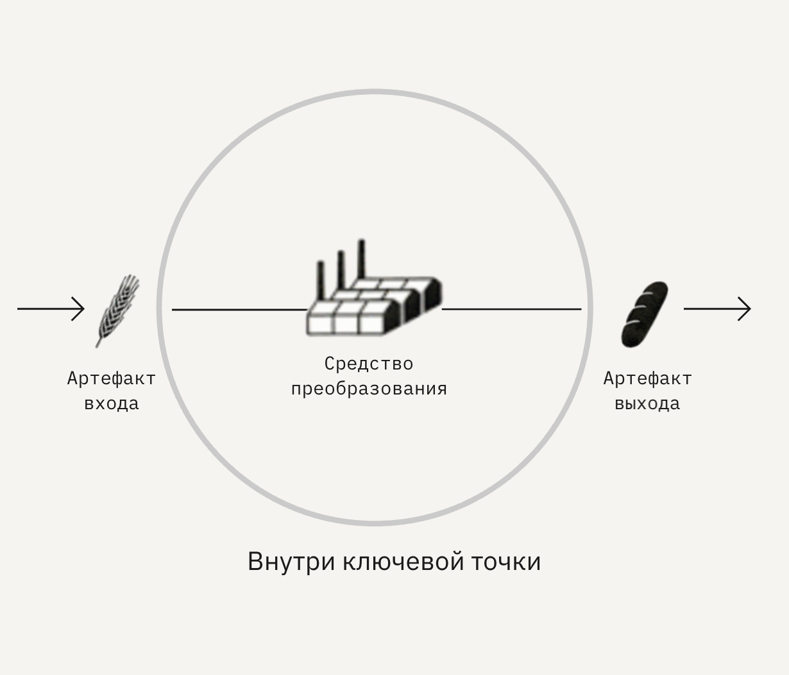

# Понятие ключевой точки

Ключевые точки — места, в которых происходят одно из трёх:

* касание человека сервиса;
* взаимодействия между людьми или людьми и частями системы;
* преобразования вещей и информации.

Ключевые точки — это не действия людей и не операции. Это группировка операций в единое место.

<figure><figcaption>
Отличие ключевых точек от операций
</figcaption></figure>
