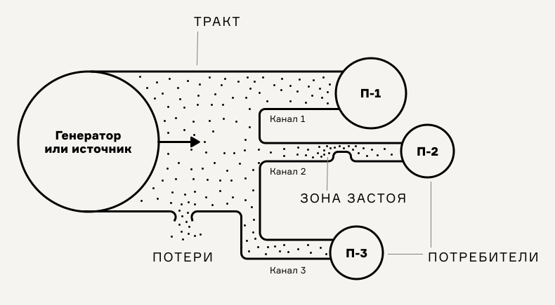

# Потоки и каналы

Карта процесса-опыта состоит из [ключевых точек](klyuchevye-tochki.md), собранных в цепочку. Соединительные линии между точками моделируют «путь», несущий от точки к точке человеческое внимание, информацию, денежные средства и вещи. Проектировщику важно понимать, что движется по этим путям.&#x20;

Хорошо организованный поток переносит от точки к точке часть информации (например, данные в ИТ-системе) или реальных вещей (товары, бухгалтерские документы, когда они печатные). Хорошо организовать его должны мы как проектировщики системы. В общем, любую систему переноса потока можно рассматривать так. Она имеет свой естественный источник или искусственный — генератор. По дороге важно не расплескать ничего, что внутри путей. Потерями могут быть оттёкшие пользователи, теряющаяся информация. Пути нередко разделяются на каналы — отдельные ручейки потока. В итоге всё содержимое попадает к потребителям. &#x20;

<figure><figcaption></figcaption></figure>

В Карте процесса-опыта есть способ учёта разветвления потока по каналам — это блок Каналы. В него записывают указания канала. Например, для розничной торговли разными каналами, где течёт внимание потребителя будут сайт, магазин, чат-бот, телефонный звонок.

Проектируя услугу или информационный сервис, мы добиваемся максимальной переносимости элементов всех важнейших потоков через невидимые пути системы. Ключевые точки и их соединения моделируют эти пути, но удерживать во внимании достигается ли перенос потока без потерь — задача проектировщика.

<figure><figcaption>
Течение артефактов и внимания по каналам через ключевые точки
</figcaption></figure>
